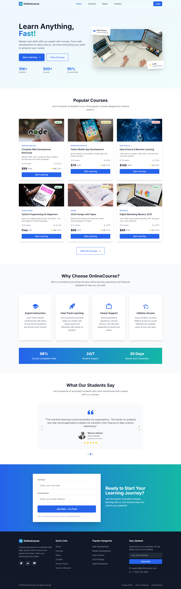

# ONLINE COURSE WEBSITE (Vue.js)

##  Project Overview

This is a modern online course website built with **Vue.js 3**, **Tailwind CSS**, and **Vue Router**. The project demonstrates how to implement reusable components using `defineProps`, `defineEmits`, and `slot`, while maintaining a clean and responsive UI design.

##  Tech Stack

* [Vue.js 3](https://vuejs.org/)
* [Tailwind CSS](https://tailwindcss.com/)
* [Vue Router](https://router.vuejs.org/)
* [Pinia](https://pinia.vuejs.org/) (state management)

## Screenshots

### Homepage

